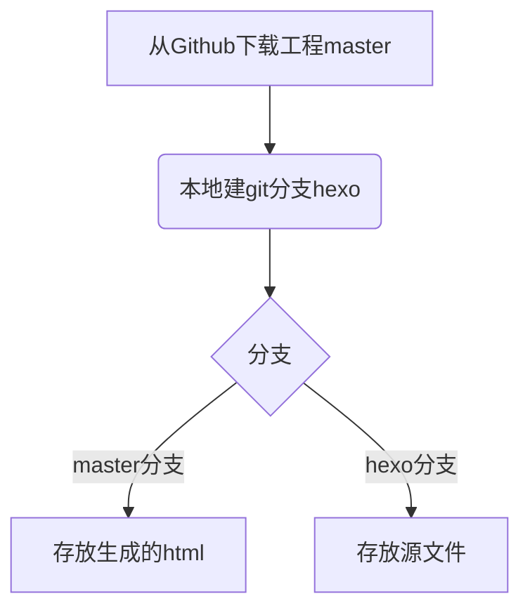

## 0.前言

之前在github已经搭建了hexo的博客，但是只能在家里的电脑上操作，后来换了一台电脑就想能不能弄成多台电脑都可以操作。比如在公司在家都可以用。所以就研究了一下如何弄了。

## 1.操作流程


## 2.操作步骤

### 2.1 旧电脑操作
将远程github的工程下载在本地

> git clone git@github.com:szchengz/szchengz.github.io.git hexo
> cd hexo
> rm -r *

拷贝以下文件
```
scaffolds/
source/
themes/
.gitignore  （这个文件配置哪些文件不上传到github）
_config.yml
package.json
```

创建一个叫hexo的分支
> git checkout -b hexo

保存所有文件到暂存区
> git add --all

提交变更
> git commit -m "创建hexo分支"

推送到GitHub，并用--set-upstream与origin创建关联，将hexo设置为默认分支

将源文件推送到GitHub的hexo分支
> git push --set-upstream origin hexo
> git branch --set-upstream-to=origin/master master
> git branch --set-upstream-to=origin/hexo hexo
> git pull


### 2.1 新电脑操作

拉取默认的主分支到目录
> git clone git@github.com:szchengz/szchengz.github.io.git hexo2
> cd hexo2/

拉取远程服务器的分支hexo
> git fetch origin hexo

本地建分支hexo并关联远程的分支 hexo
> git checkout -b hexo origin/hexo

git checkout -b dev(本地分支名称) origin/dev(远程分支名称)

切换到国内镜像（选填）
> npm config set registry https://registry.npm.taobao.org

安装hexo
> npm install hexo --save  #已经安装，就跳过啦
> npm install
> npm install hexo-deployer-git

执行以下命令检查是否成功
> hexo new hello2
> hexo g
> hexo d


## 问题

问题1：所有生成的html文件大小都为0
原因：发现是主题themes目录为空，原来yilia是一个git工程。在原来的旧电脑上面没有上传导致

## 常用命令
出现有些文件没有生成
hexo g --debug
hexo clean

查看node的依赖关系
npm ls --depth 0

$ git remote update  --更新远程仓储

下载远程仓库的所有变动
$ git fetch [remote]
